# SupportiveAI v2 — Administrative AI Platform Architecture

> Architecture Design Document (ADD) — Version 2.0

This document expands the initial proposal into an implementation-ready architecture for the **SupportiveAI** project.

---

# Table of Contents

1. Vision & Scope
2. Business Domain
3. Architecture Principles
4. Bounded Context
5. Layered Architecture
6. Modular Monolith Structure
7. AI Agent Architecture
8. Resource Allocation Module
9. Document Flow Module
10. Shared Workflow Engine
11. Event-Driven Notification
12. Database Design
13. API Design
14. AI Pipeline
15. Security (RBAC)
16. Monitoring & KPI
17. Deployment
18. Delivery Roadmap
19. ADR
20. Future Extension

---

# 1. Vision & Scope

## Goal

SupportiveAI is a unified administrative platform consisting of **four independent business modules** sharing one platform.

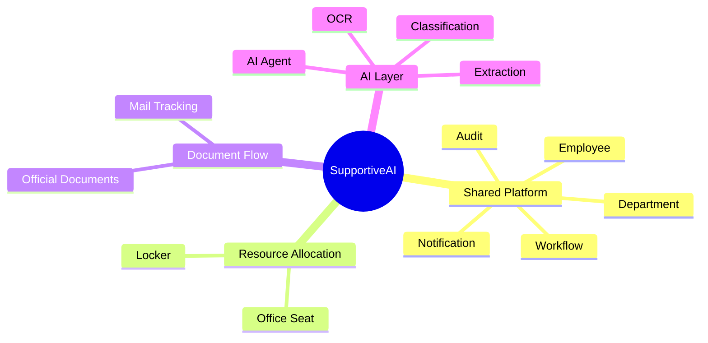

## Pilot Deliverables (6 Weeks)

| Feature | Deliverable |
|---------|-------------|
| F1 | Seat visualization MVP |
| F2 | Locker allocation workflow |
| F3 | Mail tracking workflow |
| F4 | AI document routing MVP |

---

# 2. Business Domain Analysis

## Two Bounded Contexts

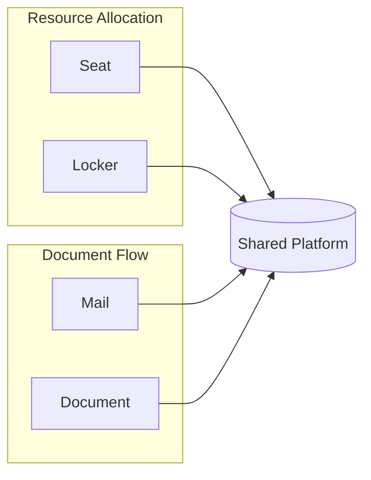

### Shared Domain Objects

- Employee
- Department
- Location
- Workflow
- Notification
- Audit
- KPI

---

# 3. Architecture Principles

## Architecture Decisions

| Decision | Reason |
|----------|--------|
| Modular Monolith | Small team / shared data |
| Shared PostgreSQL | Simpler transactions |
| AI as independent service layer | Reusable AI capability |
| Event-driven notification | Decoupled workflow |
| Human-in-the-loop | AI confidence validation |

---

# 4. High-Level Architecture

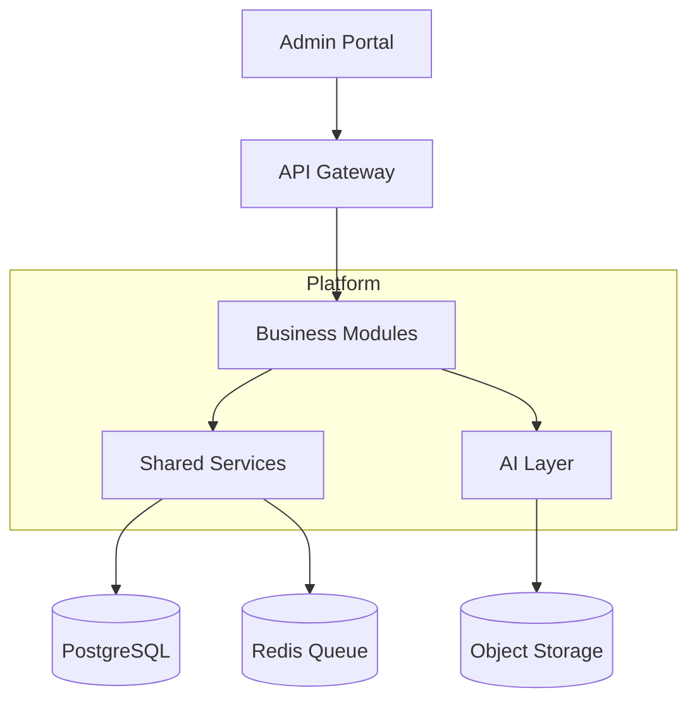

---

# 5. Layered Architecture

```text
Presentation
    │
Application
    │
Domain Modules
    ├── Resource Allocation
    └── Document Flow
    │
AI Services
    │
Infrastructure
```

## Shared Services

- Authentication
- RBAC
- Workflow Engine
- Notification Engine
- Audit Log
- Scheduler

---

# 6. Repository Structure

```text
backend/
├── app/
│   ├── api/
│   ├── core/
│   ├── shared/
│   ├── modules/
│   │   ├── resource_allocation/
│   │   └── document_flow/
│   ├── ai/
│   │   ├── ocr/
│   │   ├── parser/
│   │   ├── extraction/
│   │   ├── classifier/
│   │   └── agent/
│   ├── workflow/
│   ├── notification/
│   └── scheduler/
└── tests/

docs/
    architecture/
```

---

# 7. AI Agent Architecture

## Agent Orchestration

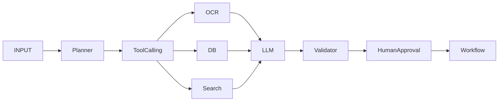

## AI Agent Responsibilities

| Agent | Responsibility |
|-------|----------------|
| Planner | Decide execution steps |
| Extraction Agent | Extract document metadata |
| Routing Agent | Recommend department/person |
| Validation Agent | Confidence checking |
| Notification Agent | Trigger reminders |

---

# 8. Resource Allocation Module

## Domain Workflow

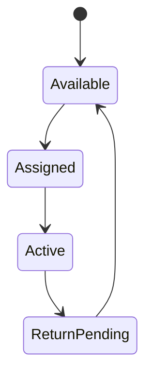

## Database Model

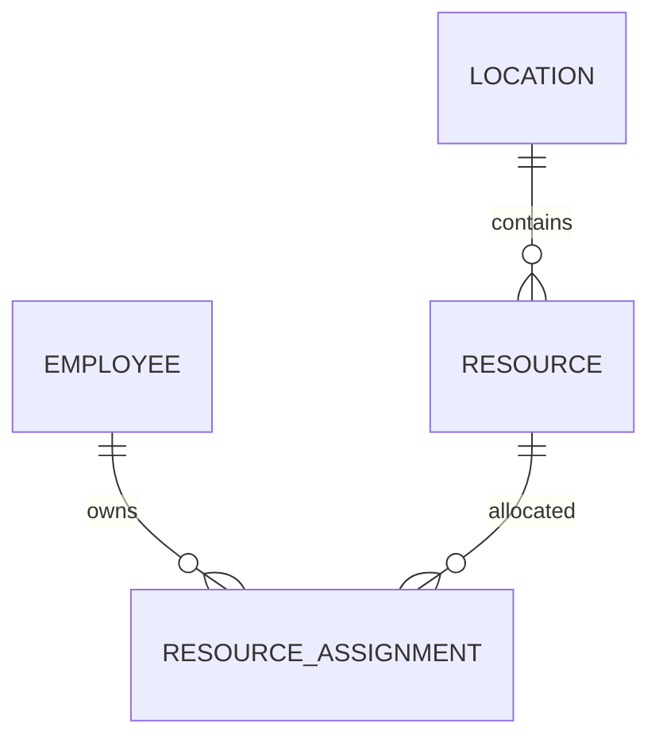

## APIs

| API | Description |
|-----|-------------|
| GET /resources | List resources |
| POST /resources/assign | Assign resource |
| POST /resources/return | Return resource |
| GET /resources/history | Assignment history |

---

# 9. Office Seat Planning Architecture

## Layout Engine

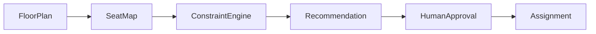

## Phase 1 MVP

- Upload floor map.
- Visual seat editor.
- Manual drag/drop assignment.
- Vacancy statistics.

## Phase 2

- Optimization.
- Simulation.
- AI recommendation.

---

# 10. Locker Management

## Workflow

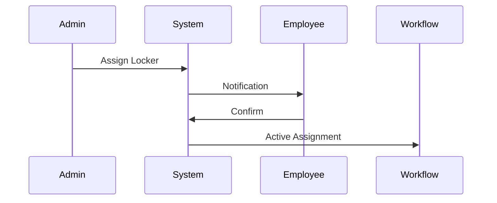

## KPI

- Allocation time.
- Return rate.
- Idle locker percentage.

---

# 11. Mail Tracking Module

## Workflow

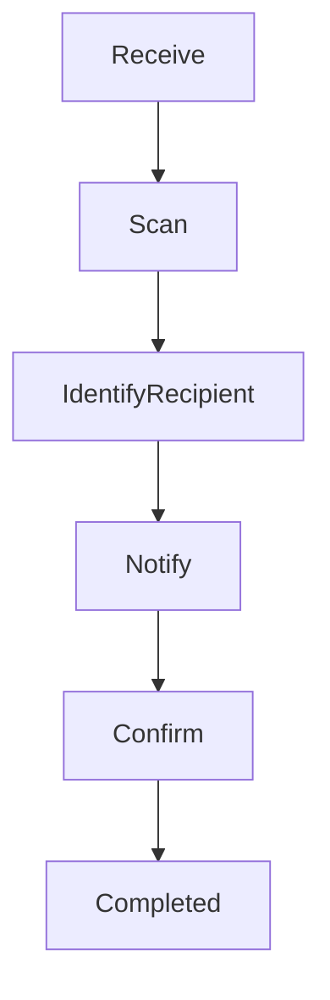

## AI Usage

- OCR QR Code.
- Recipient matching.
- Department prediction.

---

# 12. Official Document Module

## End-to-End Workflow

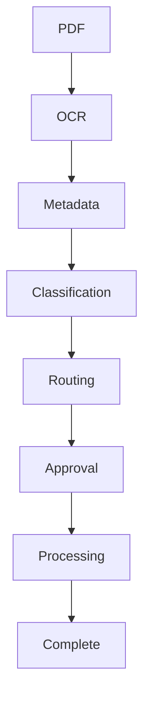

## Extracted Metadata

| Field |
|-------|
| Document Number |
| Sender |
| Receiver |
| Date |
| Deadline |
| Priority |
| Document Type |

---

# 13. Shared Workflow Engine

## Generic Workflow Model

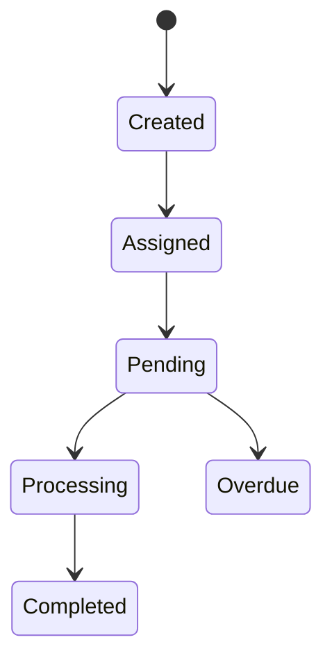

## Workflow Configuration

| State | SLA |
|-------|-----|
| Assigned | 24h |
| Pending | 48h |
| Overdue | Reminder every 24h |

---

# 14. Event Bus Architecture

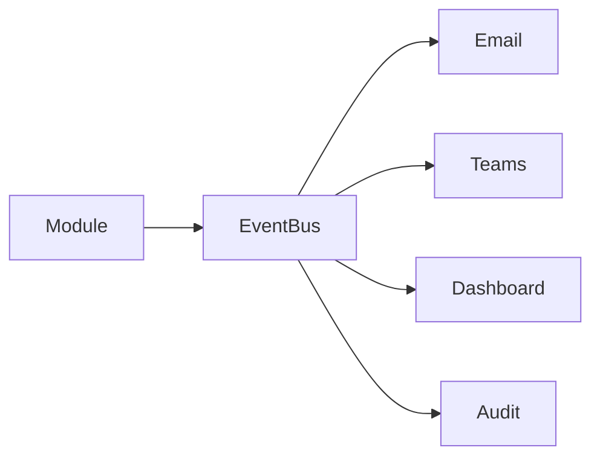

## Event Examples

| Event |
|------|
| DOCUMENT_RECEIVED |
| DOCUMENT_OVERDUE |
| LOCKER_ASSIGNED |
| SEAT_CHANGED |

---

# 15. Database Design

## Core ER Diagram

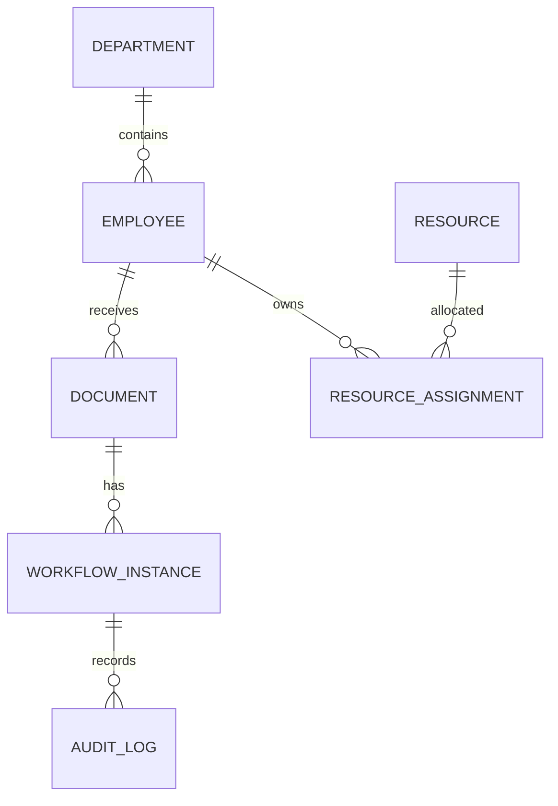

## Suggested Tables

- employee
- department
- location
- seat
- locker
- resource_assignment
- document
- document_attachment
- workflow_instance
- workflow_history
- notification
- audit_log
- ai_prediction
- ai_feedback

---

# 16. AI Pipeline

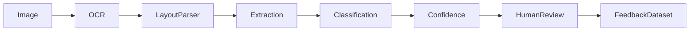

## Confidence Threshold

| Confidence | Action |
|------------|--------|
| ≥95% | Auto Process |
| 80–95% | Human Verify |
| ＜80% | Manual Input |

---

# 17. API Design

## REST APIs

### Employee

- GET /employees
- GET /employees/{id}

### Documents

- POST /documents/upload
- GET /documents
- POST /documents/{id}/confirm

### Locker

- POST /lockers/assign
- POST /lockers/return

### Workflow

- GET /workflow/{id}
- POST /workflow/{id}/transition

---

# 18. Security & RBAC

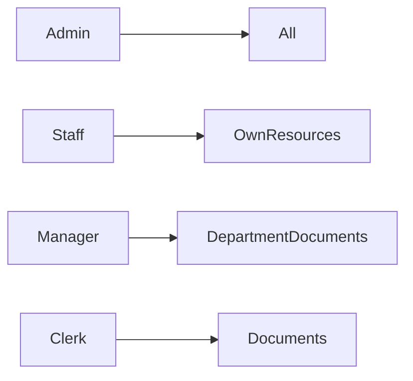

## Audit Log

Every state transition creates:

- Actor
- Timestamp
- Old State
- New State
- Metadata

---

# 19. Monitoring & KPI Dashboard

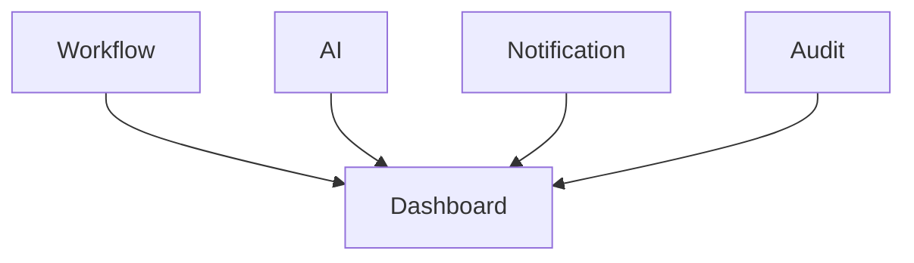

## Dashboard Sections

- Processing Time.
- SLA.
- AI Accuracy.
- Human Corrections.
- Automation Rate.

---

# 20. Deployment Architecture

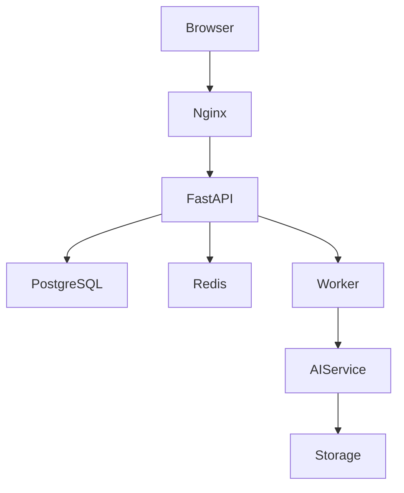

## Suggested Stack

| Layer | Technology |
|-------|------------|
| Backend | FastAPI |
| Database | PostgreSQL |
| Queue | Redis |
| Storage | MinIO / S3 |
| AI | LangGraph + OpenAI |
| OCR | PaddleOCR / Tesseract |

---

# 21. Sequence Diagram — AI Document Routing

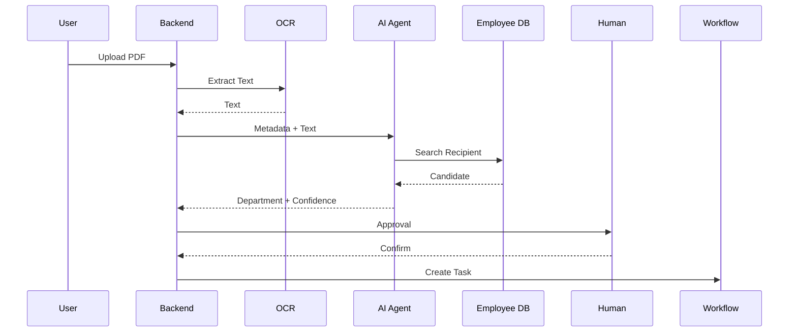

---

# 22. Six-Week Roadmap

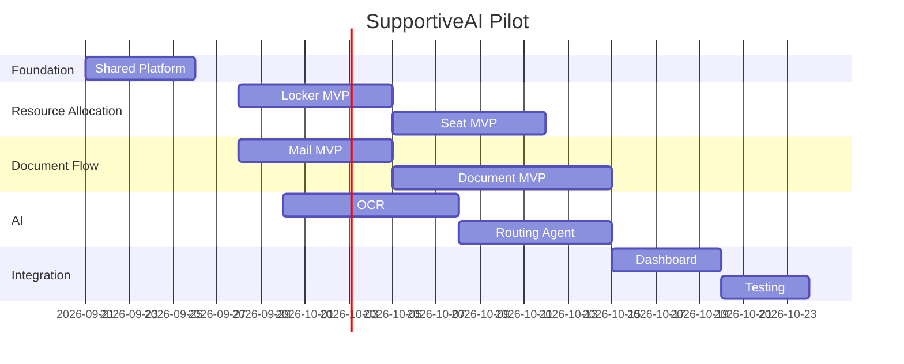

---

# 23. Architecture Decision Records

## ADR-001

Use Modular Monolith.

## ADR-002

Shared Workflow Engine.

## ADR-003

AI Agent separated from business modules.

## ADR-004

Event-driven Notification.

## ADR-005

Human-in-the-loop for AI confidence validation.

---

# 24. Future Extension

## Phase 2

- Seat Optimization Agent.
- Asset Allocation Agent.
- Knowledge Base (GraphRAG).
- AI Copilot for Administrative Staff.

## Phase 3

- Multi-office support.
- Microsoft Teams Bot.
- Email Auto Ingestion.
- Analytics Recommendation Engine.

---

# Appendix

## Technology Mapping

| Component | Recommendation |
|-----------|---------------|
| Agent Framework | LangGraph |
| LLM Provider | OpenAI GPT-5.x |
| Vector Database | pgvector |
| Object Storage | MinIO |
| OCR | PaddleOCR |
| Scheduler | APScheduler / Celery |

## Coding Standards

- Domain-first architecture.
- Repository Pattern.
- Service Layer.
- Event publishing through shared event dispatcher.
- DTO separation for API layer.

---

**Version:** v2.0

**Status:** Ready for implementation.
