# Administrative AI Platform Architecture
## SupportiveAI

> Solution Architecture Design for 4 Administrative AI Pilot Modules

---

# 1. Executive Summary

This document proposes a unified architecture for the four administrative AI pilot topics as **one platform with four independent business modules** implemented using a **Modular Monolith** architecture.

## Pilot Scope (6 weeks)

| Module | Business Domain |
|--------|-----------------|
| F1 | Office Seat Planning |
| F2 | Locker Allocation |
| F3 | Incoming Mail Tracking |
| F4 | Official Document Management |

**Architecture Principle**

> One Platform + Four Modules + Shared AI Layer + Shared Workflow Engine.

---

# 2. Business Domain Analysis

## Bounded Context

```mermaid
flowchart LR
    A[Office Seat Planning]
    B[Locker Allocation]
    C[Mail Tracking]
    D[Official Documents]

    subgraph Resource Allocation
        A
        B
    end

    subgraph Document Flow
        C
        D
    end

    Resource Allocation --- Shared[(Shared Platform)]
    Document Flow --- Shared
```

Two business domains share employee, department, workflow, notification and KPI services.

---

# 3. Overall Platform Architecture

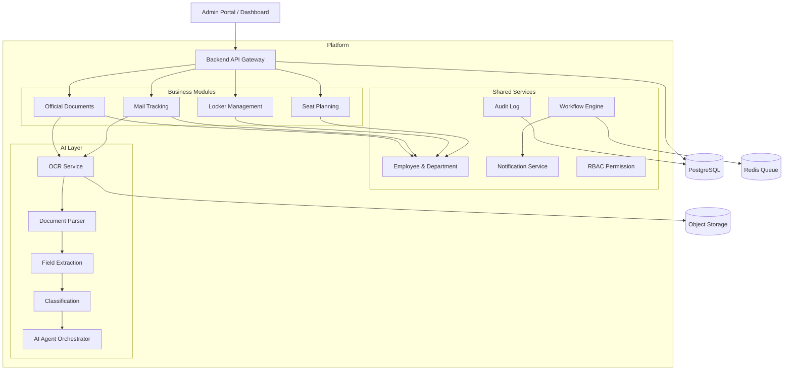

---

# 4. Layered Architecture

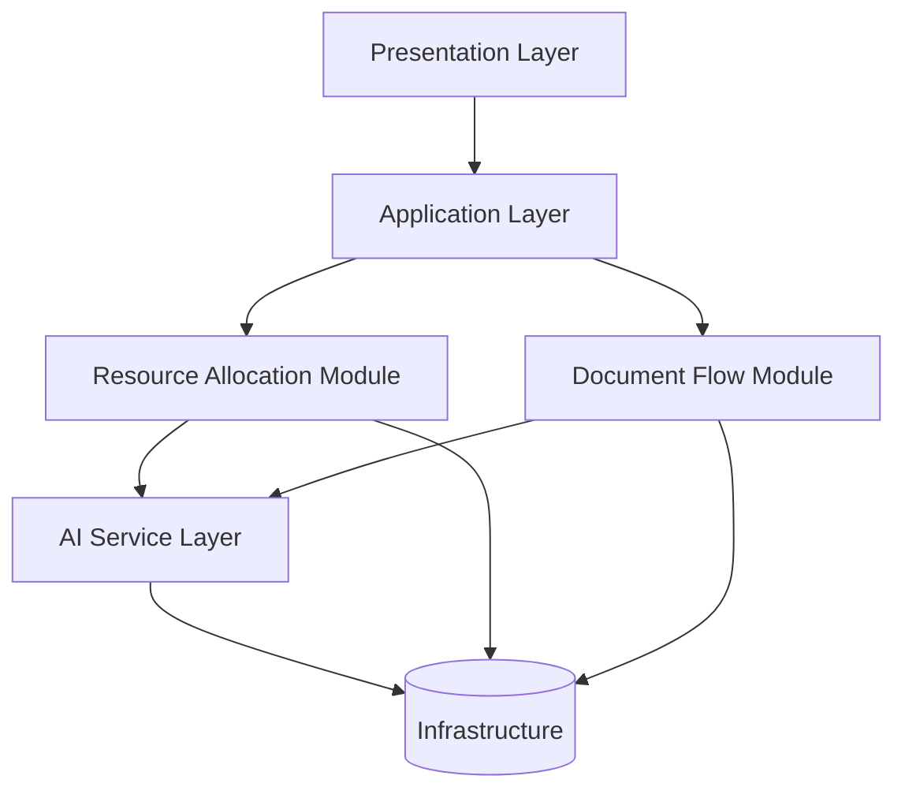

---

# 5. Shared Workflow Engine

Every module is implemented as a configurable state machine.

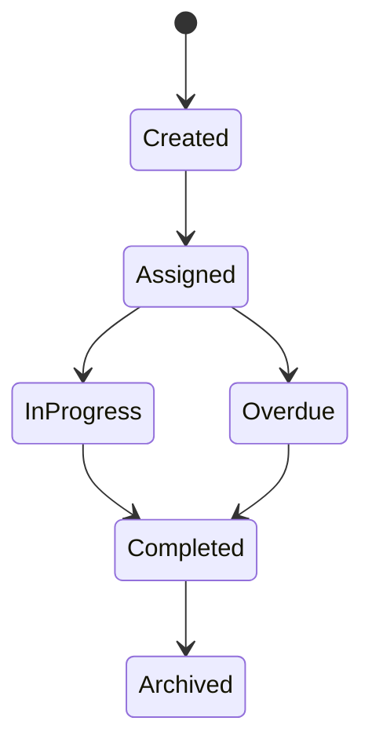

Used by:

- Locker Allocation
- Mail Tracking
- Official Documents
- Seat Assignment Approval

---

# 6. Event-Driven Notification

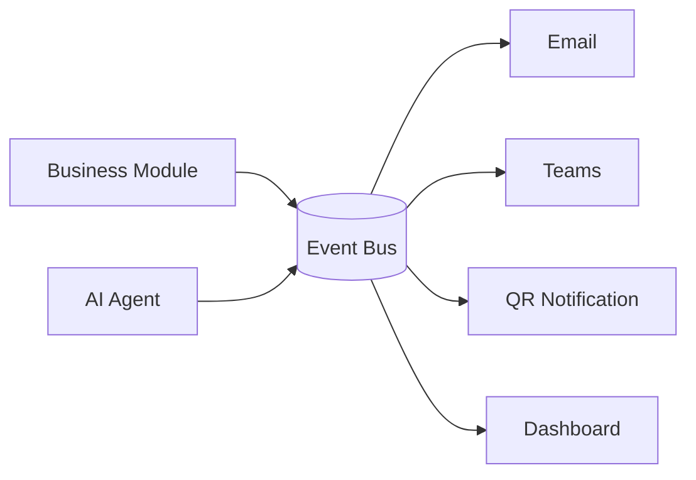

---

# 7. Resource Allocation Module

## Entity Relationship

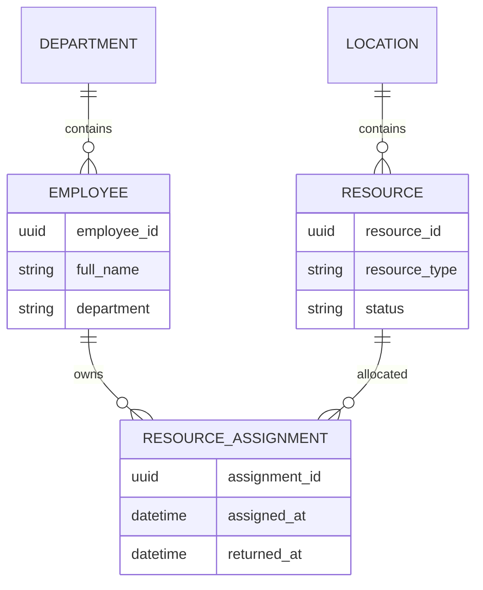

## Workflow

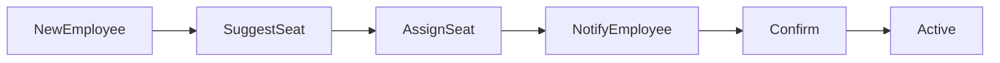

---

# 8. Document Flow Module

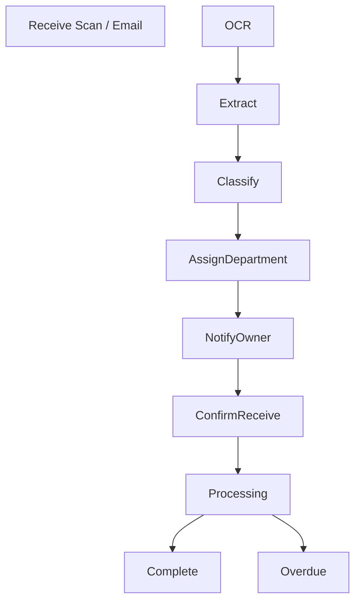

---

# 9. AI Pipeline

## OCR + Extraction Pipeline

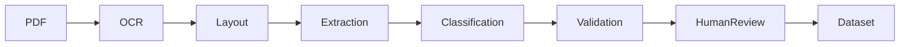

### AI Components

| Component | Purpose |
|----------|---------|
| OCR | Convert image to text |
| Layout Parser | Identify structure |
| Extractor | Metadata extraction |
| Classifier | Document category |
| Validator | Confidence scoring |
| Human Review | Feedback collection |

---

# 10. AI Agent Architecture

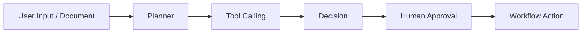

## Tool Calling Examples

| Tool | Used In |
|------|---------|
| OCR Tool | Document |
| Employee Search | Mail / Document |
| Workflow Tool | All modules |
| Notification Tool | All modules |

---

# 11. Core Data Model

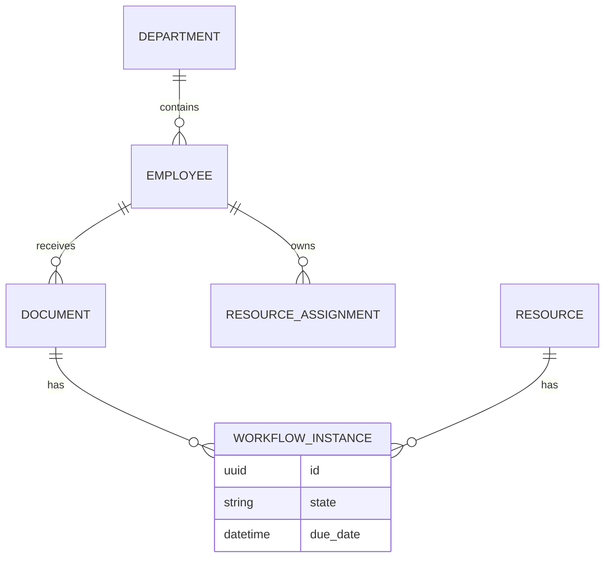

---

# 12. RBAC Permission Model

| Role | Permission |
|------|------------|
| Admin HC | Full access |
| Employee | View own resources/documents |
| Department Manager | Approve department documents |
| Văn thư | Manage incoming/outgoing documents |

---

# 13. KPI Architecture

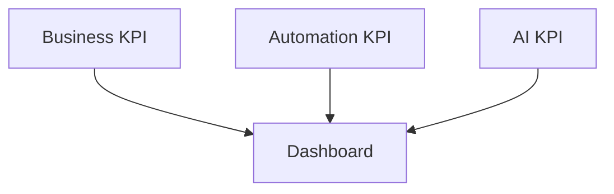

## KPI Matrix

| KPI Type | Metric |
|----------|--------|
| Business | Processing Time |
| Business | SLA Completion |
| Automation | Auto-routing Rate |
| Automation | Reminder Automation |
| AI | OCR Accuracy |
| AI | Extraction Accuracy |
| AI | Classification Accuracy |
| AI | Human Correction Rate |

---

# 14. API Boundary

## Resource Allocation APIs

| Method | Endpoint |
|--------|----------|
| GET | /resources |
| POST | /resources/assign |
| POST | /resources/return |
| GET | /resources/history |

## Document APIs

| Method | Endpoint |
|--------|----------|
| POST | /documents/upload |
| GET | /documents |
| POST | /documents/{id}/confirm |
| POST | /documents/{id}/approve |

---

# 15. Deployment Architecture

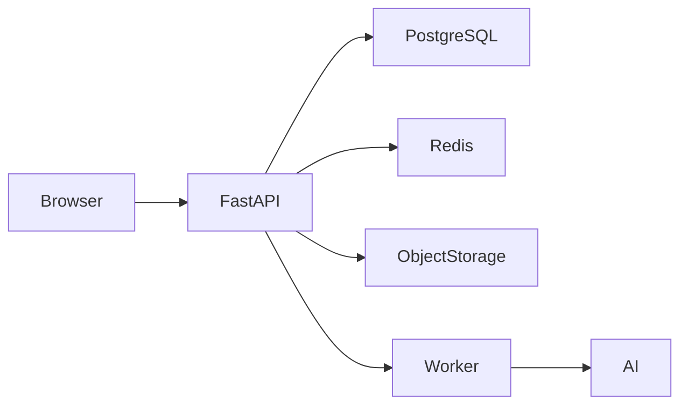

---

# 16. 6-Week Delivery Plan

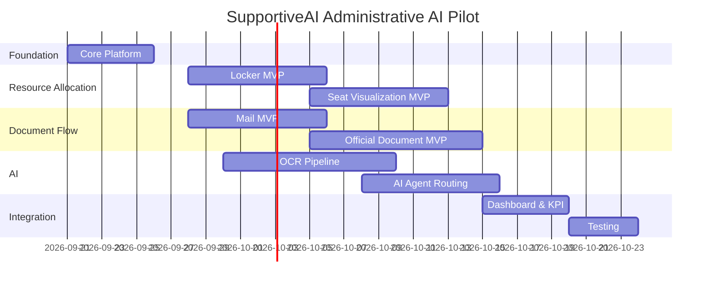

---

# 17. Risks

| Risk | Mitigation |
|------|------------|
| Dirty employee data | Standardize employee ID in Week 1 |
| OCR quality | Human review with confidence threshold |
| Scope creep in Seat Planning | Deliver visualization MVP first |
| Integration conflicts | Shared API contract + module ownership |

---

# 18. Architecture Decisions (ADR)

## ADR-001 — Modular Monolith

**Decision**

Use one codebase and one database with isolated modules.

**Reason**

- Small team.
- Six-week pilot.
- Shared workflow and AI services.

---

## ADR-002 — Shared Workflow Engine

Workflow engine is implemented once and configured per module.

---

## ADR-003 — AI Agent Layer

AI orchestration is separated from business logic through tool calling.

---

## ADR-004 — Event-Driven Notification

Business modules publish events instead of directly sending notifications.

---

# 19. Suggested Repository Structure

```text
SupportiveAI/
├── backend/
│   ├── modules/
│   │   ├── resource_allocation/
│   │   ├── document_flow/
│   │   └── shared/
│   ├── ai/
│   │   ├── ocr/
│   │   ├── parser/
│   │   ├── extraction/
│   │   └── agent/
│   ├── workflow/
│   ├── notification/
│   └── auth/
├── docs/
│   └── architecture/
│       └── admin-ai-platform-architecture.md
└── frontend/
```

---

# 20. Implementation Priorities

## Phase 1 (Pilot)

- Shared Platform.
- Locker Allocation.
- Mail Tracking.
- OCR Pipeline.
- Dashboard.

## Phase 2

- Seat Optimization Engine.
- AI Layout Recommendation.
- Official Document Routing Agent.
- Analytics & Recommendation Engine.

---

# Conclusion

The recommended architecture is:

> **Administrative AI Platform = Shared Platform + Four Independent Business Modules + AI Agent Layer**

This design maximizes code reuse, supports independent KPI measurement for each pilot topic, and remains achievable within a six-week implementation timeline.
